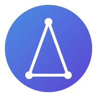

 

    
     
     
    <b>Appconda, Web, Mobil ve Flutter uygulamaları geliştirmek için bir backend platformudur. Secdiginiz programlama dillerinde en iyi geliştirici deneyimi sunacak şekilde optimize edilmiştir.</b>
     
     

Appconda, Web, Mobil, Native veya Backend uygulamaları için Docker mikro hizmetleriyle paketlenmiş, uçtan uca bir backend platformudur. Modern bir backend API'sini sıfırdan oluşturmanın zorluklarını ve rutin işlerini ortadan kaldırarak, güvenli uygulamaları daha hızlı geliştirmenizi sağlar.

Appconda, kullanıcı kimlik doğrulaması ve çeşitli giriş yöntemleri, kullanıcı ve ekip verilerini yönetmek için bir veritabanı, dosya depolama ve yönetimi, resim düzenleme, Cloud Functions gibi pek çok hizmeti uygulamanıza zahmetsizce entegre etmenize olanak tanır.

Daha fazla bilgi için: [https://appconda.io](https://appconda.io)

## Appconda Backend OS

### Modules
- [**Auth Module**](#account)
- [**Identity Module**]()
- [**Managed Database Module**]()
- [**Storage Module**]()
- [**Configuration Module**]()
- [**Payment Module**]()
- [**Messaging Module**]()
- [**Localization Module**]()
- [**Realtime Module**]()
- [**License Module**]()
- [**Spider**]()
- [**Tracer**]()

### Pre Build & Reusable Applets
- [Document Management]()
- [Task Managment]()
- [Workflow]()
- [Forms]()
- [Log Management]()
- [Meeting Managment]()
- [Process Mining]()
- [Chat]()
- [Comments]()
- [Community]()
- [OKR]()
- [CMS Kit]()
- [Bloging]()
- [Feature Management]()

<table style="border: none !important">
<tr>
<td>

</td>
<td> 
<a href="https://appconda.io" target="_blank"> Document Management</a>
    </td>
<tr>
<tr>
<td>

</td>
<td> 
<a href="https://appconda.io" target="_blank"> Feature Management</a>
    </td>
</tr>
</table>

### Ready to use Entegration Brokers
- [Jira]()

### Features
- [Caching]()
- [Multitenancy]()
- [Audit Logs]()
- [Distrubited Event Bus]()
- [Background Jobs]()
- [Extendabilty]()

### APIs
- [Realtime]()
- [Rest]()
- [GraphQL]()

### SDKs
Below is a list of currently supported platforms and languages.

#### Client

- ✅ &nbsp; [Web](https://github.com/appconda/sdk-for-web)
- ✅ &nbsp; [Flutter](https://github.com/appconda/sdk-for-flutter)
- ✅ &nbsp; [Apple](https://github.com/appconda/sdk-for-apple)
- ✅ &nbsp; [Android](https://github.com/appconda/sdk-for-android)
- ✅ &nbsp; [React Native](https://github.com/appconda/sdk-for-react-native)

#### Server

- ✅ &nbsp; [NodeJS](https://github.com/appconda/sdk-for-node)
- ✅ &nbsp; [PHP](https://github.com/appconda/sdk-for-php)
- ✅ &nbsp; [Dart](https://github.com/appconda/sdk-for-dart)
- ✅ &nbsp; [Deno](https://github.com/appconda/sdk-for-deno)
- ✅ &nbsp; [Ruby](https://github.com/appconda/sdk-for-ruby)
- ✅ &nbsp; [Python](https://github.com/appconda/sdk-for-python)
- ✅ &nbsp; [Kotlin](https://github.com/appconda/sdk-for-kotlin)
- ✅ &nbsp; [Swift](https://github.com/appconda/sdk-for-swift)
- ✅ &nbsp; [.NET](https://github.com/appconda/sdk-for-dotnet)

İçerik Tablosu:

- [Kurulum](#installation)
  - [Unix](#unix)
  - [Windows](#windows)
    - [CMD](#cmd)
    - [PowerShell](#powershell)
  - [Daha Eski Bir Sürümden Yükseltme](#upgrade-from-an-older-version)
- [Tek Tıkla Kurulumlar](#one-click-setups)
- [Başlangıç](#getting-started)
  - [Hizmetler](#services)
  - [SDK'ler](#sdks)
    - [İstemci](#client)
    - [Sunucu](#server)
    - [Topluluk](#community)
- [Mimari](#architecture)
- [Katkıda Bulunma](#contributing)
- [Güvenlik](#security)
- [Bizi Takip Edin](#follow-us)
- [Lisans](#license)

# Appconda Servisleri

## Auth Service (Identity Management)
Bu servis, uygulamanızın kullanıcı kimlik doğrulama sistemini yönetir. Kullanıcıların güvenli bir şekilde uygulamaya giriş yapmalarını sağlar. Mevcut kullanıcı oturumlarını izler, hangi cihazlardan giriş yapıldığını takip eder ve çeşitli giriş yöntemlerini (örneğin; e-posta, mac adresi vb.) yönetir. Ayrıca güvenlik olaylarını (şüpheli giriş denemeleri gibi) kaydeder ve bu olayların izlenmesine olanak tanır. Kullanıcılar, hesaplarını yönetebilir, şifre değiştirme gibi işlemleri buradan gerçekleştirebilir.

## User Service
Bu servis, sistemde bulunan tüm kullanıcıları listelemeyi ve yönetmeyi sağlar. Frontend tarafından kullanıcıları ekleyebilir, silebilir veya düzenleyebilirsiniz. Kullanıcıların kimlik bilgilerini doğrulama, kullanıcı rollerini atama gibi işlemler yapılabilir. Özellikle Server SDK'ları ile yapılan entegrasyonlar sayesinde, kullanıcılarınızın verilerini API üzerinden rahatlıkla yönetebilirsiniz. Bu modül aynı zamanda kullanıcı bazlı verilerin güvenli bir şekilde işlenmesine olanak tanır.

## Database Service (Managed Database)
Veritabanı yönetimi için kullanılan bu modül, uygulamanızdaki verilerin depolandığı yerleri organize eder. Frontend üzerinden database ve collection'lar (tablolar) oluşturabilir, bu collection'lar içindeki dokümanları oluşturabilir, güncelleyebilir veya silebilirsiniz. Dokümanları listeleyebilir, gelişmiş filtreleme özellikleri ile spesifik verilere ulaşabilirsiniz. Ayrıca, verilerin güvenli ve verimli bir şekilde saklanmasını sağlayarak, veri bütünlüğünü korur.

## Storage Service
Bu servis, uygulamanızdaki dosya depolama işlemlerini yönetir. Frontend üzerinden dosya oluşturma, silme, okuma ve önizleme işlemleri yapılabilir. Örneğin, uygulamanızda kullanıcılarınızın yüklediği dosyaları depolayabilirsiniz. Yüklenen dosyalar, ClamAV antivirüs sistemi ile taranır; bu sayede güvenli olduklarından emin olunur. Dosyalar istenirse şifrelenmiş olarak güvenli bir şekilde saklanabilir. Ayrıca, dosya boyutlarını ve formatlarını uygulamanıza uygun hale getirmek için özelleştirilmiş dosya önizlemeleri de yapabilirsiniz.

## Messaging Service
Bu servis, kullanıcılarla çeşitli yöntemlerle iletişim kurmanızı sağlar. Push bildirimleri, e-postalar veya SMS metin mesajları aracılığıyla kullanıcılarınıza ulaşabilirsiniz. Örneğin, bir kullanıcı hesabını başarıyla oluşturduğunda veya bir işlem gerçekleştiğinde bu modül aracılığıyla kullanıcıya bilgilendirme mesajları gönderebilirsiniz. Mesajların içeriğini ve gönderim zamanını özelleştirebilirsiniz. Ayrıca, toplu bildirimler göndermek ya da belirli kullanıcı gruplarına özel mesajlar iletmek de mümkündür.

## Workflow Service
Bu servis, uygulamanızdaki iş süreçlerinin otomatikleştirilmesini ve düzenlenmesini sağlar. İş akışları, belirli bir dizi adımı otomatik olarak gerçekleştirmenize olanak tanır. Kullanıcılarınızın uygulamada gerçekleştirdiği eylemler veya sistemde oluşan olaylar sonrasında belirli bir sürecin başlatılmasını sağlayabilirsiniz. Örneğin, bir form gönderildikten sonra onay sürecini başlatmak, bir görevin tamamlanmasının ardından ilgili kişilere bildirim göndermek ya da belirli bir zaman diliminde periyodik olarak tekrarlanan işlemleri yürütmek mümkündür. Bu modül, iş süreçlerini optimize eder ve insan müdahalesine gerek kalmadan belirli görevlerin yürütülmesini sağlar. Workflow servisi BPMN 2.0 uyumlu olduğundan diğer sistemlerle de uyumludur.

## Forms Service
Forms servisi, uygulamanızda dinamik formlar oluşturmanızı ve yönetmenizi sağlar. Kullanıcı veya cihazlardan veri toplamak için çeşitli alanlar (metin kutuları, seçim listeleri, radyo butonları vb.) içeren formlar tasarlayabilirsiniz. Bu modül, kullanıcıdan veya cihazdan toplanan verilerin otomatik olarak kaydedilmesini ve uygun workflow içerisine yönlendirilmesini sağlar. Ayrıca, form doldurma süreçlerini kişiselleştirme (örneğin, formun konuma veya kullanıcı profil bilgilerine göre özelleşmesi) ve toplanan verilerin analiz edilmesi gibi ek özellikler de sunar. Formlar modülü, müşteri geri bildirimleri, anketler, başvurular ve kayıt işlemleri gibi durumlarda etkin bir veri toplama aracı olarak kullanılabilir.

## Process Mining Service

Process Mining servisi, uygulamanızdaki iş süreçlerini analiz ederek süreçlerin nasıl ilerlediğini anlamanıza yardımcı olur. Kullanıcıların sistem içindeki davranışlarını, işlem akışlarını ve süreç verimliliğini takip eder. Gerçekleşen işlemler ve aktivitelerden elde edilen verilere dayanarak iş akışlarındaki darboğazları, gecikmeleri veya hatalı adımları tespit edebilirsiniz. Bu modül, iş süreçlerinizi optimize etmek, gereksiz adımları ortadan kaldırmak ve operasyonel verimliliği artırmak için değerli içgörüler sunar. Örneğin, bir sürecin çok uzun sürdüğünü veya belirli bir adımdaki başarısızlık oranlarının yüksek olduğunu tespit ederek, bu süreçleri iyileştirebilirsiniz.